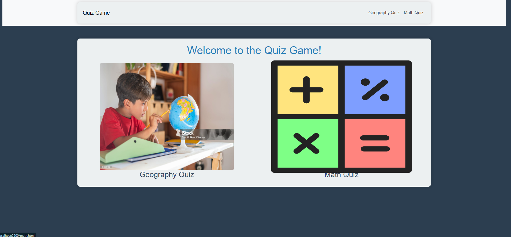
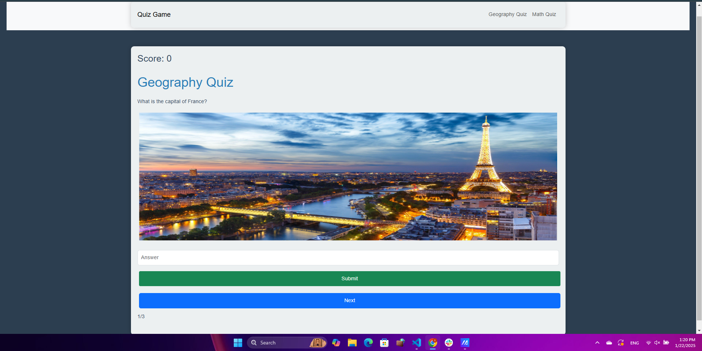
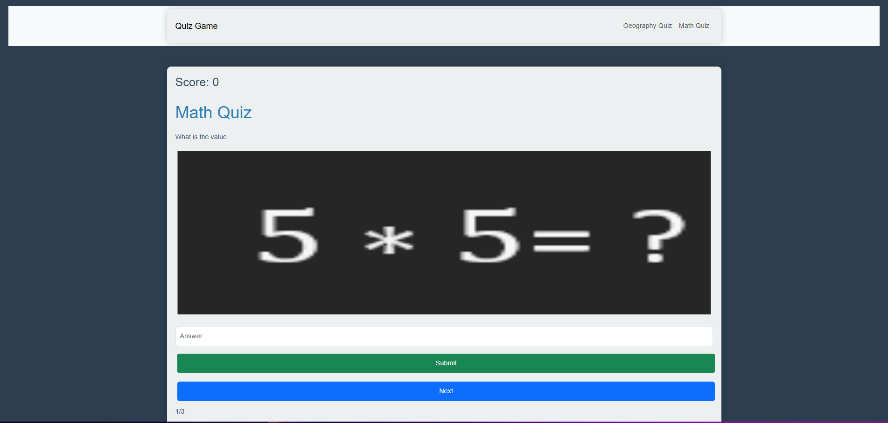

# Quiz Game
Welcome to the Quiz Game! This web application offers interactive quizzes in various subjects, including Geography and Math. Test your knowledge and have fun while learning!

## Features
- Interactive quizzes for different subjects.

## Technologies Used
- HTML5
- CSS3
- JavaScript
- Bootstrap 5.3.3

## Installation
To run this project locally, follow these steps:

1. Clone the repository:
   - git clone https://github.com/SayedAli451/Project.git
   - cd Project
   - code .
   
## How to Play the Quiz Game

1. **Start the Quiz**:
   - Click on the "Category" Image to begin the quiz.
   
   

2. **Answering Questions**:
   - You will be presented with a question along with an image related to the question.
   - Type your answer in the input field provided.
   
   

3. **Submit Your Answer**:
   - Click the "Submit" button to submit your answer.
   - You will receive immediate feedback indicating whether your answer was correct or wrong.

4. **Score Tracking**:
   - Your score will be updated after each question. Correct answers will increase your score.

5. **Quiz Completion**:
   - The quiz will consist of a limited number of questions .
   - Once all questions have been answered, you will see your final score displayed on the screen.

6. **Restarting the Quiz**:
   - After completing the quiz, you can click the "Start Quiz" button again to play another round.

    Enjoy and have fun!